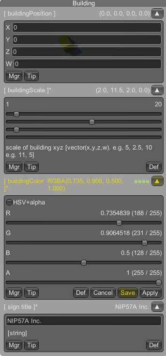

https://github.com/fuqunaga/PrefsGUI のようにUnityのランタイム上で設定値の変更・保存が行える。





設定値の閲覧、ヒントの表示、編集、リセット、保存などが行える。

```` csharp
    public static NipaFloat speed = new NipaFloat(DemoParam.TRANSPORT_PREFS, "jeepSpeed", 5f, "ジープのスピード");
````
設定値は初期化時に所属するマネージャID、設定値のID,デフォルト値、ヒント（オプショナル）を与える。


マネージャごとにエディタとスタンドアロンでの設定ファイルのパスを設定できる。複数のマネージャを用意する事で複数の設定ファイルを運用できる。


設定値は個別にGUIで呼び出すことで編集できる他、マネージャのウインドウではそのマネージャに所属する設定値すべてを閲覧・編集することもできる。


直接設定ファイルのXMLを編集する場合に備えて、ヒントを設定ファイルに書き込むこともできる
